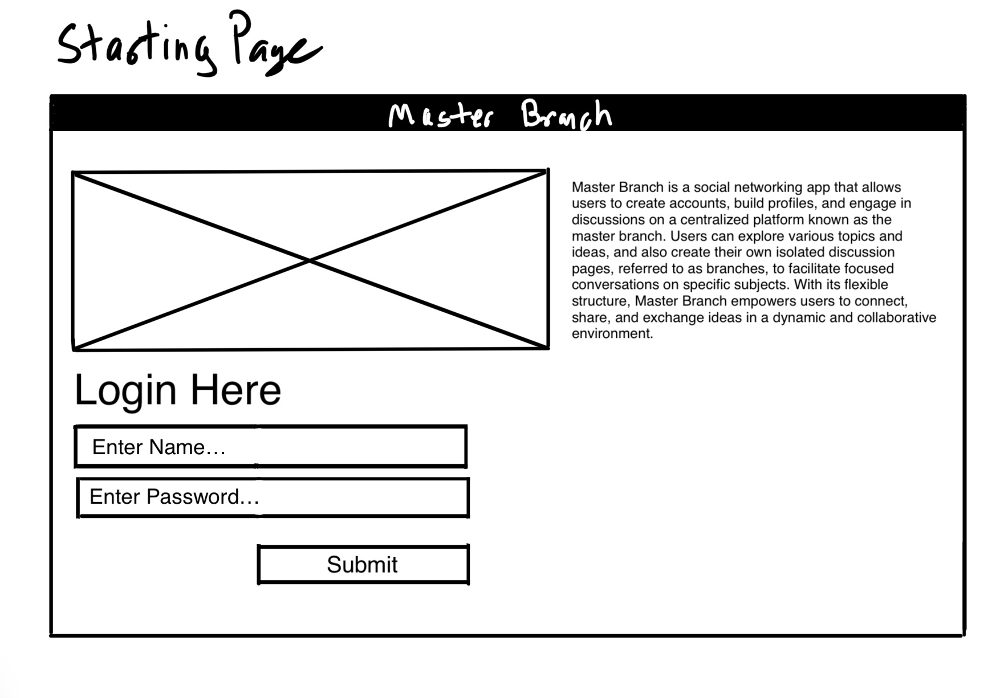
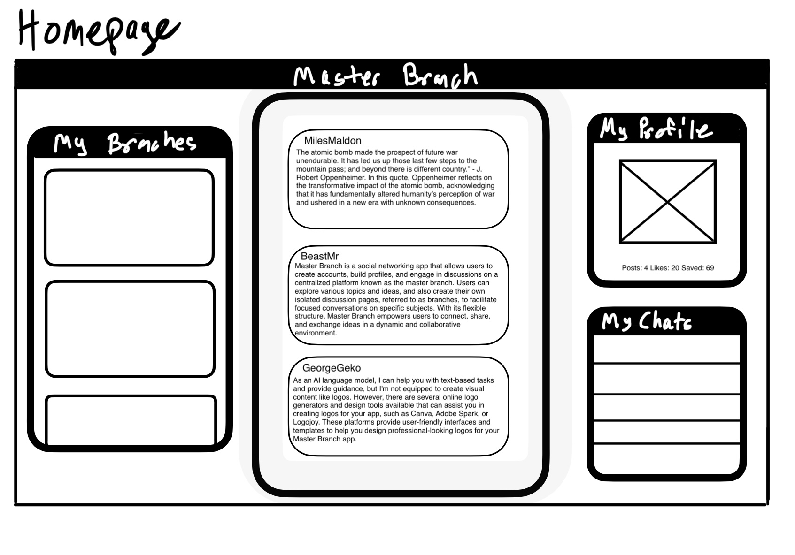
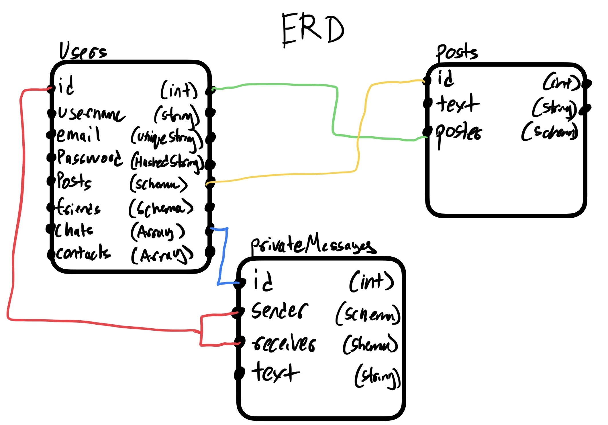

## GoodForum

is a dynamic web application designed to provide a comprehensive platform for interactive discussions and community engagement. Built with modern web technologies, it offers users a seamless experience to connect, share insights, and explore diverse, positive topics that bring value to the community.
Community Rules:

1. Don't post discriminatory material or hate speech here.
2. Don't post porn or sexual media.
3. Don't advertise, self-promote, or otherwise market anything.
4. Avoid religious or religious debate content.
5. Stay on-topic. Posts must be Forum Topic & Description.
6. Don't collect personal information from the community.
7. Don't disrupt other places.
8. Don't stir up drama.
9. Avoid politics.
10. Avoid spreading misinformation.
11. Don't engage in piracy/copyright/trademark infringement.
12. Stay positive and encourage others. Don't discourage or disparage people.
    Key Features:
    • Real-time Discussions: Engage in real-time discussions on various topics of interest.
    • Positive Community: A space for users to converse about positive topics and bring value to users. Hate and bullying will not be tolerated. Hateful or offensive Forums will be deleted.
    • User Profiles: Customize your profile and connect with like-minded individuals.
    • Rich Media Support: Share images and videos to enrich discussions.
    • Responsive Design: Access GoodForum from any device, ensuring a consistent experience.
    Technologies Used:
    • Frontend: React.js, Javascript, Material-UI, Axios
    • Backend: Node.js, Express.js, MongoDB
    • Deployment: DigitalOcean
    Explore GoodForum today and join a vibrant community of thinkers and doers!
    TRELLO For User Stories, Wireframes, and ERD

https://trello.com/b/aDPYrUfn/api

# Tentative Login Page

# Tentative Home Page

# ERD

potential background images:

https://miro.medium.com/v2/resize:fit:1400/1*IhV2ehy9HCyL7DJB8ZmwKg.gif

https://thumbs.gfycat.com/AlienatedUnripeGnu-max-1mb.gif

https://38.media.tumblr.com/ae5fe30067a5af472caa72bb1a86c2f1/tumblr_ngnzomGdj21terwlso1_500.gif

https://i.gifer.com/embedded/download/S9K7.gif

https://i.pinimg.com/originals/f2/cf/ac/f2cfac681460bf34741d56c1285e94d8.gif

https://i.gifer.com/1pX9.gif
